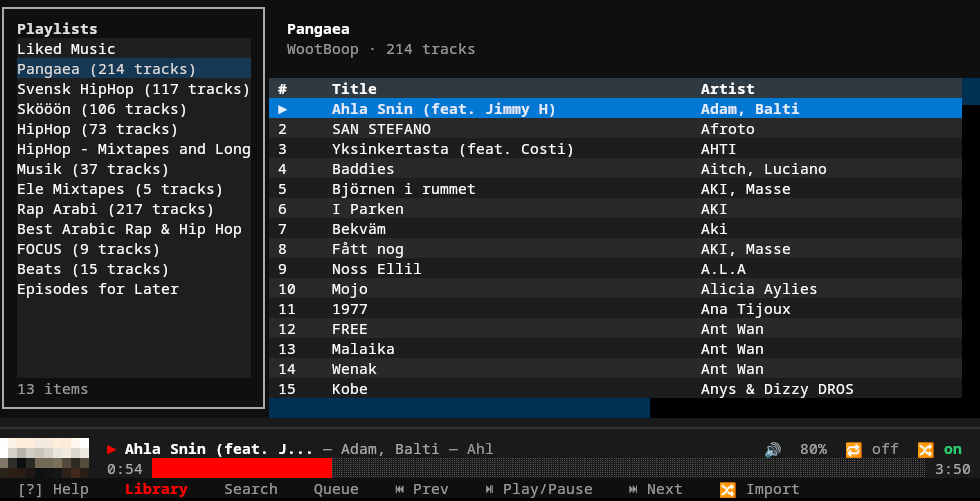
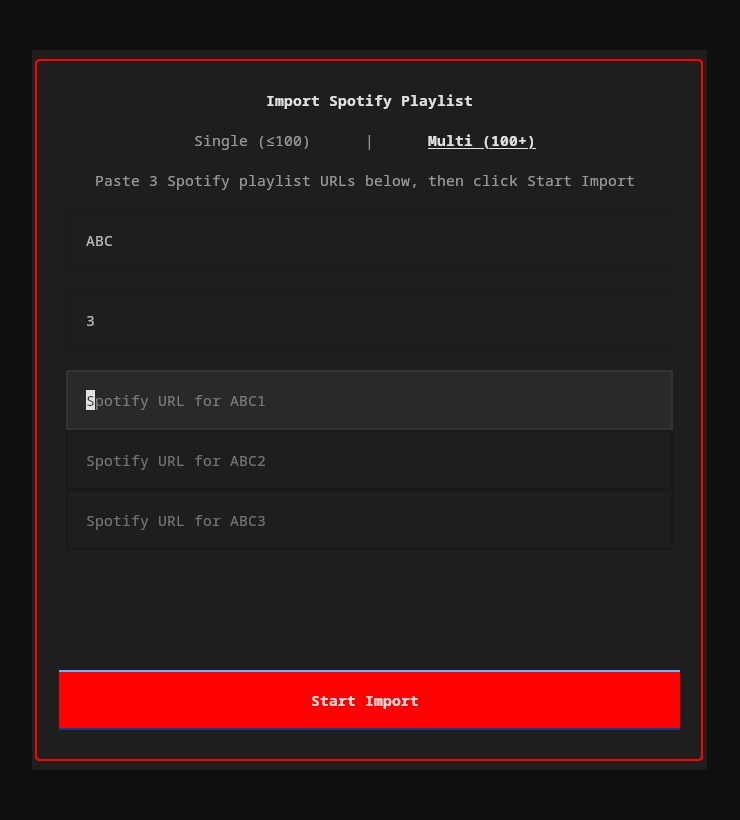

# ytm-player

A full-featured YouTube Music player for the terminal. Browse your library, search, queue tracks, and control playback — all from a TUI with vim-style keybindings. Runs on Linux, macOS, and Windows.



## Features

- **Full playback control** — play, pause, seek, volume, shuffle, repeat via mpv with gapless audio
- **9 pages** — Library, Search, Browse, Context (album/artist/playlist), Lyrics, Queue, Liked Songs, Recently Played, Help
- **Vim-style navigation** — `j`/`k` movement, multi-key sequences (`g l` for library, `g s` for search), count prefixes (`5j`)
- **Predictive search** — debounced with 300ms delay, music-first mode with toggle to all results
- **Spotify import** — import playlists from Spotify via API or URL scraping
- **History tracking** — play history + search history stored in SQLite with listening stats
- **Audio caching** — LRU cache (1GB default) for offline-like replay of previously heard tracks
- **Offline downloads** — right-click any track → "Download for Offline" to save locally
- **Discord Rich Presence** — show what you're listening to in your Discord status
- **Last.fm scrobbling** — automatic scrobbling with Now Playing updates
- **Album art** — colored half-block rendering in the playback bar (requires Pillow)
- **MPRIS integration** — hardware media keys and desktop player controls via D-Bus
- **CLI mode** — headless subcommands for scripting (`ytm search`, `ytm stats`, `ytm history`)
- **IPC control** — control the running TUI from another terminal (`ytm play`, `ytm pause`, `ytm next`)
- **Fully configurable** — TOML config files for settings, keybindings, and theme

## Requirements

- **Python 3.12+**
- **[mpv](https://mpv.io/)** — audio playback backend, must be installed system-wide
- A **YouTube Music** account (free or Premium)

## Installation

### 1. Install mpv

mpv is required for audio playback. Install it with your system package manager:

```bash
# Arch / CachyOS / Manjaro
sudo pacman -S mpv

# Ubuntu / Debian
sudo apt install mpv

# Fedora
sudo dnf install mpv

# macOS (Homebrew)
brew install mpv

# Windows (Scoop)
scoop install mpv

# Windows (Chocolatey)
choco install mpv
```

### 2. Install ytm-player

```bash
git clone https://github.com/peternaame-boop/ytm-player.git
cd ytm-player
python -m venv .venv
source .venv/bin/activate
pip install -e .
```

#### Optional extras

```bash
# Spotify playlist import
pip install -e ".[spotify]"

# MPRIS media key support (Linux only, requires D-Bus)
pip install -e ".[mpris]"

# Album art rendering (colored half-block images)
pip install -e ".[images]"

# Discord Rich Presence
pip install -e ".[discord]"

# Last.fm scrobbling
pip install -e ".[lastfm]"

# All optional features
pip install -e ".[spotify,mpris,images,discord,lastfm]"

# Development tools (pytest, ruff)
pip install -e ".[dev]"
```

### 3. Authenticate

```bash
ytm setup
```

The setup wizard has two modes:

**Automatic (preferred):** It scans your installed browsers (Helium, Chrome, Chromium, Brave, Firefox, Edge, Vivaldi, Opera) for YouTube Music cookies. If found, credentials are extracted automatically — no manual steps needed. Just make sure you're logged into [music.youtube.com](https://music.youtube.com) in at least one browser.

**Manual fallback:** If auto-detection fails (e.g. cookies are encrypted or browser isn't supported), the wizard walks you through pasting raw request headers:

1. Open [music.youtube.com](https://music.youtube.com) in your browser
2. Open DevTools (F12) → Network tab
3. Refresh the page, filter requests by `/browse`
4. Click a `music.youtube.com` request
5. Right-click "Request Headers" → Copy
6. Paste into the wizard and press Enter on an empty line

The wizard accepts multiple paste formats (Chrome alternating lines, Firefox `Name: Value`, terminal escape-separated).

Credentials are stored in `~/.config/ytm-player/headers_auth.json` with `0o600` permissions.

## Usage

### TUI (interactive)

```bash
# Launch the player
ytm
```

### CLI (headless)

These work without the TUI running:

```bash
# Search YouTube Music
ytm search "daft punk"
ytm search "bohemian rhapsody" --filter songs --json

# Listening stats
ytm stats
ytm stats --json

# Play history
ytm history
ytm history search

# Cache management
ytm cache status
ytm cache clear

# Spotify import
ytm import "https://open.spotify.com/playlist/..."
```

### Playback control (requires TUI running)

Control the running TUI from another terminal via IPC:

```bash
ytm play          # Resume playback
ytm pause         # Pause playback
ytm next          # Skip to next track
ytm prev          # Previous track
ytm seek +10      # Seek forward 10 seconds
ytm seek -5       # Seek backward 5 seconds
ytm seek 1:30     # Seek to 1:30

ytm now            # Current track info (JSON)
ytm status         # Player status (JSON)
ytm queue          # Queue contents (JSON)
ytm queue add ID   # Add track by video ID
ytm queue clear    # Clear queue
```

## Keybindings

### Keyboard

| Key | Action |
|-----|--------|
| `space` | Play/Pause |
| `n` | Next track |
| `p` | Previous track |
| `+` / `-` | Volume up/down |
| `j` / `k` | Move down/up |
| `enter` | Select/play |
| `g l` | Go to Library |
| `g s` | Go to Search |
| `g b` | Go to Browse |
| `z` | Go to Queue |
| `l` | Go to Lyrics |
| `g y` | Go to Liked Songs |
| `g r` | Go to Recently Played |
| `?` | Help (full keybinding reference) |
| `tab` | Focus next panel |
| `a` | Track actions menu |
| `/` | Filter current list |
| `Ctrl+r` | Cycle repeat mode |
| `Ctrl+s` | Toggle shuffle |
| `backspace` | Go back |
| `q` | Quit |

### Mouse

| Action | Where | Effect |
|--------|-------|--------|
| Click | Progress bar | Seek to position |
| Scroll up/down | Progress bar | Scrub forward/backward (commits after 0.6s pause) |
| Scroll up/down | Volume display | Adjust volume by 5% |
| Click | Repeat button | Cycle repeat mode (off → all → one) |
| Click | Shuffle button | Toggle shuffle on/off |
| Click | Footer buttons | Navigate pages, play/pause, prev/next |
| Right-click | Track row | Open context menu (play, queue, add to playlist, etc.) |

Custom keybindings: edit `~/.config/ytm-player/keymap.toml`

## Configuration

Config files live in `~/.config/ytm-player/` (respects `$XDG_CONFIG_HOME`):

| File | Purpose |
|------|---------|
| `config.toml` | General settings, playback, cache, UI |
| `keymap.toml` | Custom keybinding overrides |
| `theme.toml` | Color scheme customization |
| `headers_auth.json` | YouTube Music credentials (auto-generated) |

Open config directory in your editor:

```bash
ytm config
```

### Example `config.toml`

```toml
[general]
startup_page = "library"     # library, search, browse

[playback]
audio_quality = "high"       # high, medium, low
default_volume = 80          # 0-100
autoplay = true
seek_step = 5                # seconds per seek

[cache]
enabled = true
max_size_mb = 1024           # 1GB default
prefetch_next = true

[ui]
album_art = true
progress_style = "block"     # block or line
sidebar_width = 30
col_index = 4                # 0 = auto-fill
col_title = 0                # 0 = auto-fill
col_artist = 30
col_album = 25
col_duration = 8

[notifications]
enabled = true
timeout_seconds = 5

[mpris]
enabled = true

[discord]
enabled = false              # Requires pypresence

[lastfm]
enabled = false              # Requires pylast
api_key = ""
api_secret = ""
session_key = ""
username = ""
```

### Example `theme.toml`

```toml
[colors]
background = "#0f0f0f"
foreground = "#ffffff"
primary = "#ff0000"
secondary = "#aaaaaa"
accent = "#ff4e45"
success = "#2ecc71"
warning = "#f39c12"
error = "#e74c3c"
muted_text = "#999999"
border = "#333333"
selected_item = "#2a2a2a"
progress_filled = "#ff0000"
progress_empty = "#555555"
playback_bar_bg = "#1a1a1a"
```

## Spotify Import

Import your Spotify playlists into YouTube Music — from the TUI or CLI.



### How it works

1. **Extract** — Reads track names and artists from the Spotify playlist
2. **Match** — Searches YouTube Music for each track using fuzzy matching (title 60% + artist 40% weighted score)
3. **Resolve** — Tracks scoring 85%+ are auto-matched. Lower scores prompt you to pick from candidates or skip
4. **Create** — Creates a new private playlist on your YouTube Music account with all matched tracks

### Two modes

| Mode | Use case | How |
|------|----------|-----|
| **Single** (≤100 tracks) | Most playlists | Paste one Spotify URL |
| **Multi** (100+ tracks) | Large playlists split across parts | Enter a name + number of parts, paste a URL for each |

### From the TUI

Click **Import** in the footer bar (or press the import button). A popup lets you paste URLs, choose single/multi mode, and watch progress in real-time.

### From the CLI

```bash
ytm import "https://open.spotify.com/playlist/37i9dQZF1DXcBWIGoYBM5M"
```

Interactive flow: fetches tracks, shows match results, lets you resolve ambiguous/missing tracks, name the playlist, then creates it.

### Extraction methods

The importer tries two approaches in order:

1. **Spotify Web API** (full pagination, handles any playlist size) — requires a free [Spotify Developer](https://developer.spotify.com/) app. On first use, you'll be prompted for your `client_id` and `client_secret`, which are stored in `~/.config/ytm-player/spotify.json`
2. **Scraper fallback** (no credentials needed, limited to ~100 tracks) — used automatically if API credentials aren't configured

For playlists over 100 tracks, set up the API credentials.

## Architecture

```
src/ytm_player/
├── app.py              # Main Textual application
├── cli.py              # Click CLI entry point
├── ipc.py              # Unix socket IPC for CLI↔TUI communication
├── config/             # Settings, keymap, theme (TOML)
├── services/           # Backend services
│   ├── auth.py         #   Browser cookie auth
│   ├── ytmusic.py      #   YouTube Music API wrapper
│   ├── player.py       #   mpv audio playback
│   ├── stream.py       #   yt-dlp stream URL resolution
│   ├── queue.py        #   Playback queue with shuffle/repeat
│   ├── history.py      #   SQLite play/search history
│   ├── cache.py        #   LRU audio file cache
│   ├── mpris.py        #   D-Bus MPRIS media controls
│   ├── download.py     #   Offline audio downloads
│   ├── discord_rpc.py  #   Discord Rich Presence
│   ├── lastfm.py       #   Last.fm scrobbling
│   └── spotify_import.py  # Spotify playlist import
├── ui/
│   ├── playback_bar.py # Persistent bottom bar (track info, progress, controls)
│   ├── theme.py        # Theme system with CSS variable generation
│   ├── pages/          # Library, Search, Browse, Context, Lyrics, Queue, Liked Songs, Recently Played, Help
│   ├── popups/         # Actions menu, playlist picker, Spotify import
│   └── widgets/        # TrackTable, PlaybackProgress, AlbumArt
└── utils/              # Terminal detection, formatting helpers
```

**Stack:** [Textual](https://textual.textualize.io/) (TUI) · [ytmusicapi](https://github.com/sigma67/ytmusicapi) (API) · [yt-dlp](https://github.com/yt-dlp/yt-dlp) (streams/downloads) · [python-mpv](https://github.com/jaseg/python-mpv) (playback) · [aiosqlite](https://github.com/omnilib/aiosqlite) (history/cache) · [dbus-next](https://github.com/altdesktop/python-dbus-next) (MPRIS) · [pypresence](https://github.com/qwertyquerty/pypresence) (Discord) · [pylast](https://github.com/pylast/pylast) (Last.fm)

## Troubleshooting

### "mpv not found" or playback doesn't start

Ensure mpv is installed and in your `$PATH`:

```bash
mpv --version
```

If installed but not found, check that the `libmpv` shared library is available:

```bash
# Arch
pacman -Qs mpv

# Ubuntu/Debian — you may need the dev package
sudo apt install libmpv-dev
```

### Authentication fails

- Make sure you're signed in to YouTube Music Premium in your browser
- Try a different browser: `ytm setup` auto-detects Chrome, Firefox, Brave, and Edge
- If auto-detection fails, use the manual paste method
- Re-run `ytm setup` to re-authenticate

### No sound / wrong audio device

mpv uses your system's default audio output. To change it, create `~/.config/mpv/mpv.conf`:

```
audio-device=pulse/your-device-name
```

List available devices with `mpv --audio-device=help`.

### MPRIS / media keys not working

Install the optional MPRIS dependency:

```bash
pip install -e ".[mpris]"
```

Requires D-Bus (standard on most Linux desktops). Verify with:

```bash
dbus-send --session --print-reply --dest=org.freedesktop.DBus /org/freedesktop/DBus org.freedesktop.DBus.ListNames
```

### Cache taking too much space

```bash
# Check cache size
ytm cache status

# Clear all cached audio
ytm cache clear
```

Or reduce the limit in `config.toml`:

```toml
[cache]
max_size_mb = 512
```

## License

MIT — see [LICENSE](LICENSE).

## Changelog

### v1.2.0 (2026-02-14)

**Features**
- Shuffle-aware playlist playback — double-clicking a playlist with shuffle on now starts from a random track instead of always the first
- Table sorting — sort any track list by Title (`s t`), Artist (`s a`), Album (`s A`), Duration (`s d`), or reverse (`s r`)
- Session resume — on startup, restores last queue position and shows the track in the footer (without auto-playing)
- Quit action (`q` / `Ctrl+Q`) — clean exit that clears resume state; unclean exits (terminal close/kill) preserve it

**Bug Fixes**
- Fixed queue position desync when selecting tracks with shuffle enabled (all pages: Library, Context, Liked Songs, Recently Played)
- Fixed search mode toggle showing empty box due to Rich markup interpretation (`[Music]` → `Music`)

### v1.1.1 (2026-02-13)

**Features**
- Always-visible Lyrics button in footer bar (dimmed when no track playing, active during playback)
- Clicking the active footer page navigates back to the previous page
- Library remembers selected playlist when navigating away and back
- Library auto-opens the currently-playing playlist on return
- Library restores cursor to last selected track row when navigating back (falls back to currently-playing track)
- Click outside popups to dismiss — actions menu and Spotify import close when clicking the background

**Bug Fixes**
- Fixed right-click on track table triggering playback instead of only opening context menu
- Fixed auto-advance bug: songs after the 2nd track would not play due to stale `_end_file_skip` counter
- Fixed thread-safe skip counter — check+increment now atomic under lock
- Fixed duplicate end-file events causing track skipping (debounce guard)
- Fixed `player.play()` failure leaving stale `_current_track` state
- Fixed unhandled exceptions in stream resolution crashing the playback chain
- Fixed `player.play()` exceptions silently stopping all playback
- Fixed Browse page crash from unawaited async mount operations
- Fixed API error tracebacks polluting TUI with red stderr overlay
- Reset skip counter on mpv crash recovery

### v1.1.0 (2026-02-12)

**Features**
- Liked Songs page (`g y`) — browse and play your liked music
- Recently Played page (`g r`) — local history from SQLite
- Download for offline — right-click any track → "Download for Offline"
- Discord Rich Presence — show what you're listening to (optional, `pip install -e ".[discord]"`)
- Last.fm scrobbling — automatic scrobbling + Now Playing (optional, `pip install -e ".[lastfm]"`)
- Gapless playback enabled by default
- Queue persistence across restarts (saved in session.json)
- Track change notifications wired to `[notifications]` config section
- New config sections: `[discord]`, `[lastfm]`, `[playback].gapless`, `[playback].api_timeout`
- Configurable column widths via `[ui]` settings (`col_index`, `col_title`, `col_artist`, `col_album`, `col_duration`)
- Liked Songs and Recently Played pinned in library sidebar

**Security & Stability**
- IPC socket security hardening (permissions, command whitelist, input validation)
- File permissions hardened to 0o600 across all config/state files
- Thread safety for queue manager (prevents race conditions)
- mpv crash detection and automatic recovery
- Auth validation distinguishes network errors from invalid credentials
- Disk-full (OSError) handling in cache and history managers
- API timeout handling (15s default, prevents TUI hangs on slow networks)

**Performance**
- Batch DELETE for cache eviction (replaces per-row deletes)
- Deferred cache-hit commits (every 10 hits instead of every hit)
- Reuse yt-dlp instance across stream resolves (was creating new per call)
- Concurrent Spotify import matching with ThreadPoolExecutor
- Stream URL expiry checks before playback

**Bug Fixes & Code Quality**
- Fixed terminal image protocol detection (`TERM_FEATURES` returning wrong protocol)
- Fixed encapsulation break (cache private method called from app)
- Removed dead code (`_download_multiple_tracks`, redundant imports)
- API timeout now reads from settings at call time, not import time
- Extracted `_init_mpv()` helper — DRY player initialization and crash recovery
- Session state save failures now log at warning (was debug)
- Human-readable error messages throughout

**Testing & CI**
- GitHub Actions CI pipeline (ruff lint + pytest with coverage)
- 231 tests covering queue, IPC, stream resolver, cache, history, auth, downloads, Discord RPC, Last.fm, and settings

### v1.0.0 (2026-02-07)

- Initial release
- Full TUI with 7 pages (Library, Search, Browse, Context, Lyrics, Queue, Help)
- Vim-style keybindings with multi-key sequences and count prefixes
- Audio playback via mpv with shuffle, repeat, queue management
- Predictive search with music-first mode
- Spotify playlist import (API + scraper)
- Play and search history in SQLite
- Audio cache with LRU eviction (1GB default)
- Album art with colored half-block rendering
- MPRIS D-Bus integration for media key support
- Unix socket IPC for CLI↔TUI control
- CLI subcommands for headless usage
- TOML configuration for settings, keybindings, and theme
